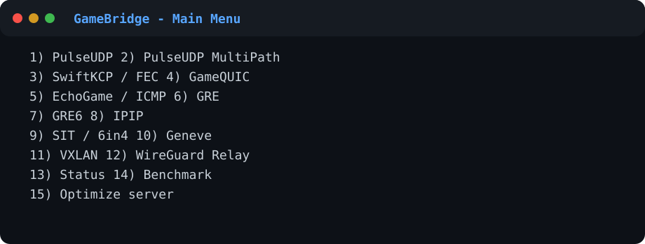
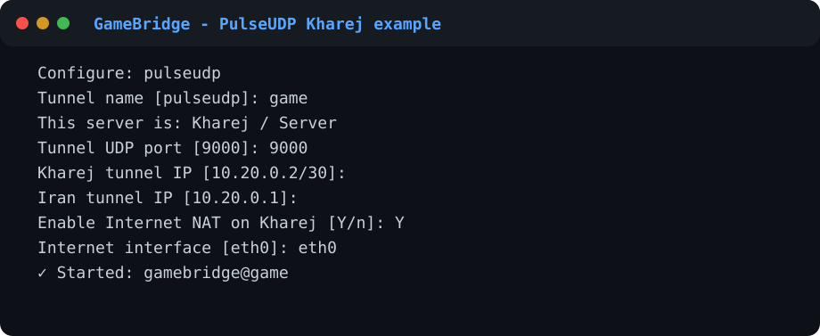
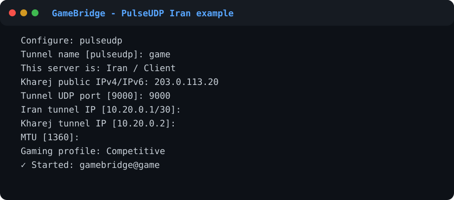
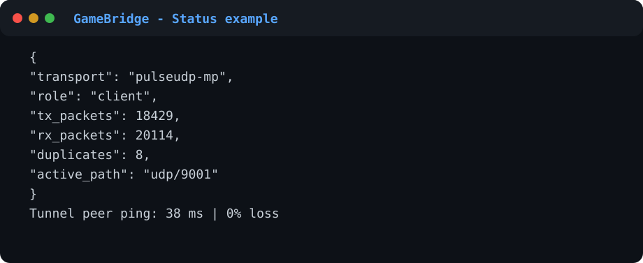
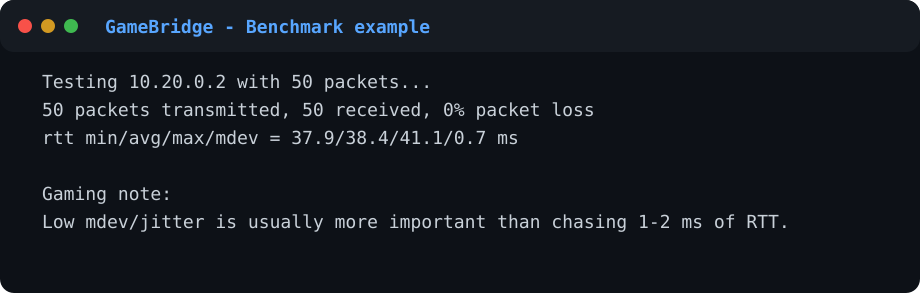

# 🎮 GameBridge

**GameBridge** یک مجموعه‌ی چندروشۀ Tunnel برای Linux است که تمرکزش روی **بازی، پینگ پایدار، jitter پایین و عبور UDP** است.

این پروژه برای سناریوی دو سرور طراحی شده:

```text
PC / Phone / Console
        │
        │ WireGuard / Game traffic
        ▼
   ┌───────────┐
   │ Iran VPS  │
   └─────┬─────┘
         │
         │ GameBridge Tunnel
         ▼
   ┌───────────┐
   │Kharej VPS │
   └─────┬─────┘
         │
         ▼
      Internet
```

> **نسخه فعلی: 0.1.0 (Beta)**  
> قبل از استفاده برای کاربر واقعی، روش انتخابی را روی VPSهای خودتان تست کنید. مسیر دیتاسنتر و ISP از اسم پروتکل مهم‌تر است.



---

## فهرست

- [برای کسی که صفر است: از کجا شروع کنم؟](#برای-کسی-که-صفر-است-از-کجا-شروع-کنم)
- [پیش‌نیازها](#پیشنیازها)
- [نصب](#نصب)
- [کدام Tunnel را انتخاب کنم؟](#کدام-tunnel-را-انتخاب-کنم)
- [PulseUDP](#1-pulseudp)
- [PulseUDP MultiPath](#2-pulseudp-multipath)
- [SwiftKCP و FEC](#3-swiftkcp--kcp-fec)
- [GameQUIC](#4-gamequic)
- [EchoGame / ICMP](#5-echogame--icmp)
- [GRE](#6-gre)
- [GRE6](#7-gre6)
- [IPIP](#8-ipip)
- [SIT / 6in4](#9-sit--6in4)
- [Geneve](#10-geneve)
- [VXLAN](#11-vxlan)
- [WireGuard Relay / Port Forward](#12-wireguard-relay--port-forward)
- [پروفایل‌های Gaming](#پروفایلهای-gaming)
- [MTU](#mtu)
- [فایروال](#فایروال)
- [Status / Logs / Benchmark](#status--logs--benchmark)
- [عیب‌یابی](#عیبیابی)
- [آپدیت و حذف](#آپدیت-و-حذف)
- [ساخت از سورس](#ساخت-از-سورس)
- [امنیت](#امنیت)
- [License](#license)

---

# برای کسی که صفر است: از کجا شروع کنم؟

برای شروع فقط این چهار چیز را بدان:

**Iran VPS** = سروری که کاربر به آن وصل می‌شود.  
**Kharej VPS** = سروری که ترافیک از آن وارد اینترنت می‌شود.  
**Public IP** = IP اصلی VPS.  
**Private/Tunnel IP** = IP داخلی که GameBridge بین دو VPS ایجاد می‌کند، مثل `10.20.0.1` و `10.20.0.2`.

برای اولین تست، **PulseUDP** را انتخاب کن. اگر مسیر UDP ناپایدار بود، بعد سراغ MultiPath، KCP یا QUIC برو.

ترتیب پیشنهادی:

```text
1. PulseUDP
2. PulseUDP MultiPath
3. GameQUIC
4. SwiftKCP
5. ICMP فقط به‌عنوان fallback
```

برای GRE/IPIP/Geneve/VXLAN باید دیتاسنتر اجازه‌ی پروتکل/UDP موردنیاز را بدهد.

---

# پیش‌نیازها

### سیستم عامل

فعلاً installer برای این‌ها طراحی شده:

- Ubuntu 20.04+
- Ubuntu 22.04 / 24.04
- Debian 11 / 12 / 13

هر دو VPS باید **root** داشته باشند.

### TUN/TAP

روی هر VPS:

```bash
ls -l /dev/net/tun
```

اگر چیزی شبیه این دیدی:

```text
crw-rw-rw- 1 root root ... /dev/net/tun
```

خوب است.

اگر فایل وجود نداشت، VPS provider باید TUN/TAP را فعال کند.

### پیدا کردن کارت اینترنت

```bash
ip route | grep default
```

مثلاً:

```text
default via 203.0.113.1 dev eth0
```

پس اسم interface اینترنت شما `eth0` است.

---

# نصب

## روش ساده بعد از Push شدن Repository

روی **هر دو سرور**:

```bash
apt update && apt install -y git
git clone https://github.com/devprogrmer/GameBridge.git
cd GameBridge
chmod +x install.sh
sudo ./install.sh
```

بعد:

```bash
sudo gamebridge
```

منوی اصلی باز می‌شود.

> فایل نصب `go mod download` انجام می‌دهد و Core را روی همان VPS build می‌کند.

### تست نصب

```bash
gamebridge version
```

و:

```bash
gamebridge keygen
```

باید یک کلید 64 کاراکتری بدهد.

---

# کدام Tunnel را انتخاب کنم؟

| روش | استفاده پیشنهادی | سربار | تحمل Loss | نیاز شبکه |
|---|---|---:|---:|---|
| PulseUDP | انتخاب اول Gaming | خیلی کم | کم | UDP |
| PulseUDP-MP | نوسان مسیر / چند flow | کم | متوسط | چند UDP port |
| SwiftKCP | مسیر packet-loss دار | متوسط | خوب | UDP |
| SwiftKCP + FEC | loss زیاد | بیشتر | خیلی خوب | UDP |
| GameQUIC | UDP خام ناپایدار | متوسط | متوسط | UDP |
| ICMP | fallback | بالا | محدود | ICMP |
| GRE | L3 ساده و سریع | خیلی کم | ندارد | IP protocol 47 |
| GRE6 | GRE روی IPv6 | خیلی کم | ندارد | IPv6 |
| IPIP | IPv4-in-IPv4 | خیلی کم | ندارد | IP protocol 4 |
| SIT | IPv6 روی IPv4 | کم | ندارد | IP protocol 41 |
| Geneve | Overlay منعطف | کم | ندارد | UDP 6081 |
| VXLAN | Overlay L2/L3 | کم | ندارد | UDP 4789 |

**نکته:** پروتکلی که روی یک دیتاسنتر عالی است ممکن است روی دیتاسنتر دیگر بد باشد.

---

# 1. PulseUDP

PulseUDP هسته‌ی UDP اختصاصی GameBridge است:

```text
TUN -> AES-GCM -> UDP -> Internet -> UDP -> AES-GCM -> TUN
```

ویژگی‌ها:

- TUN Layer 3
- UDP Native
- AES-256-GCM
- Keepalive
- RTT/Jitter path metrics
- fq_codel روی interface تونل
- NAT خودکار در Kharej

## کانفیگ Kharej

اول **Kharej** را آماده کن:

```bash
sudo gamebridge
```

انتخاب:

```text
1) PulseUDP
```

سپس:

```text
This server is:
2) Kharej / Server
```

نمونه:

```text
Tunnel name: game
Tunnel UDP port: 9000
Kharej tunnel IP: 10.20.0.2/30
Iran tunnel IP: 10.20.0.1
MTU: 1360
Profile: Competitive
Paste key: SAME_KEY
Enable Internet NAT: Yes
Internet interface: eth0
```



## کانفیگ Iran

```bash
sudo gamebridge
```

```text
1) PulseUDP
1) Iran / Client
```

نمونه:

```text
Tunnel name: game
Kharej Public IP: 203.0.113.20
UDP port: 9000
Iran tunnel IP: 10.20.0.1/30
Kharej tunnel IP: 10.20.0.2
MTU: 1360
Profile: Competitive
Generate key: Yes
```

**کلید ساخته‌شده را دقیقاً در Kharej هم وارد کن.**



## فایروال PulseUDP

روی Kharej باید UDP 9000 باز باشد.

UFW:

```bash
ufw allow 9000/udp
```

یا اگر firewall دیتاسنتر داری، UDP 9000 را آنجا هم باز کن.

## تست

از Iran:

```bash
ping 10.20.0.2
```

از Kharej:

```bash
ping 10.20.0.1
```

Status:

```bash
gamebridge status game
```

---

# 2. PulseUDP MultiPath

MultiPath همان PulseUDP است، ولی چند UDP flow دارد:

```text
Iran              Kharej
 │                  │
 ├── UDP 9000 ──────┤
 ├── UDP 9001 ──────┤
 ├── UDP 9002 ──────┤
 └── UDP 9003 ──────┘
```

GameBridge RTT و jitter مسیرها را بررسی می‌کند و مسیر بهتر را ترجیح می‌دهد.

### Stable / Lossy profile

در این profileها packetهای کوچک می‌توانند روی مسیر دوم هم duplicate شوند. سمت گیرنده Sequence ID دارد و duplicate را حذف می‌کند.

این قابلیت برای packetهای کوچک game مفید است، ولی **مصرف ترافیک را بالا می‌برد**.

## کانفیگ

در هر دو VPS:

```text
2) PulseUDP MultiPath
```

Ports را در هر دو طرف **دقیقاً یکسان** وارد کن:

```text
9000,9001,9002,9003
```

روی Kharej:

```bash
ufw allow 9000:9003/udp
```

برای Gaming اول `Competitive` را تست کن. اگر packet loss لحظه‌ای داری، `Stable` را تست کن.

---

# 3. SwiftKCP / KCP-FEC

KCP برای شبکه‌ای مناسب است که packet loss دارد و UDP خام نوسان دارد.

GameBridge از `kcp-go` استفاده می‌کند و پارامترهای low-latency را بر اساس profile تنظیم می‌کند.

```text
TUN -> KCP -> Optional FEC -> UDP
```

### Competitive

```text
FEC parity = 0
```

### Stable

```text
10 data + 2 parity
```

### Lossy

```text
10 data + 3 parity
```

FEC رایگان نیست؛ parity یعنی bandwidth اضافه.

## کانفیگ

Kharej:

```text
3) SwiftKCP
Role: Kharej
Port: 8443
Tunnel IP: 10.20.0.2/30
Peer: 10.20.0.1
Profile: Stable
NAT: Yes
```

Iran:

```text
3) SwiftKCP
Role: Iran
Kharej IP: 203.0.113.20
Port: 8443
Tunnel IP: 10.20.0.1/30
Peer: 10.20.0.2
Profile: Stable
```

روی Kharej:

```bash
ufw allow 8443/udp
```

**همه تنظیمات FEC و کلید باید در دو طرف هماهنگ باشند.**

---

# 4. GameQUIC

QUIC روی UDP اجرا می‌شود و transport encryption خود QUIC را دارد. GameBridge علاوه بر آن envelope داخلی را هم با کلید مشترک authenticate می‌کند.

برای بعضی مسیرهایی که UDP خام رفتار خوبی ندارد، QUIC ارزش تست دارد.

پیشنهاد MTU:

```text
1280
```

## Kharej

```text
4) GameQUIC
Role: Kharej
Port: 8443
Tunnel IP: 10.20.0.2/30
NAT: Yes
```

## Iran

```text
4) GameQUIC
Role: Iran
Kharej IP: 203.0.113.20
Port: 8443
Tunnel IP: 10.20.0.1/30
```

Firewall:

```bash
ufw allow 8443/udp
```

---

# 5. EchoGame / ICMP

این روش packetهای تونل را داخل ICMP Echo / Echo Reply حمل می‌کند.

**انتخاب اول Gaming نیست.** فقط وقتی UDP/GRE و روش‌های عادی مسیر خوبی ندارند تستش کن.

```text
Client -> ICMP Echo Poll -> Server
Client <- ICMP Echo Reply <- Server
```

مقادیر پیشنهادی:

```text
MTU:     900
Poll:    8 ms
Burst:   4
```

هر دو طرف باید `ICMP tunnel ID` یکسان داشته باشند.

مثلاً:

```text
4242
```

اگر Provider یا Firewall ICMP را rate-limit کند، این روش پینگ خوبی نخواهد داشت.

---

# 6. GRE

GRE یک Tunnel kernel-native است و overhead کمی دارد.

نیاز:

```text
IP protocol 47
```

**Port ندارد.**

در منو:

```text
6) GRE
```

Iran example:

```text
Public local: 198.51.100.10
Public remote: 203.0.113.20
Private: 10.30.0.1/30
MTU: 1400
```

Kharej:

```text
Public local: 203.0.113.20
Public remote: 198.51.100.10
Private: 10.30.0.2/30
MTU: 1400
```

تست:

```bash
ping 10.30.0.2
```

اگر GRE کار نکرد، Firewall دیتاسنتر را برای protocol 47 بررسی کن.

---

# 7. GRE6

همان GRE است اما endpointهای carrier از IPv6 استفاده می‌کنند.

هر دو سرور باید IPv6 قابل دسترسی داشته باشند.

در منو:

```text
7) GRE6
```

برای بعضی مسیرها، IPv6 می‌تواند route متفاوت و بهتری نسبت به IPv4 داشته باشد.

---

# 8. IPIP

IPIP ساده‌ترین IPv4-in-IPv4 tunnelهای kernel است.

نیاز:

```text
IP protocol 4
```

در منو:

```text
8) IPIP
```

نمونه private pair:

```text
Iran:    10.32.0.1/30
Kharej:  10.32.0.2/30
```

IPIP encryption داخلی ندارد. اگر privacy روی carrier لازم داری، از روش رمزنگاری‌شده استفاده کن.

---

# 9. SIT / 6in4

SIT برای عبور IPv6 داخل IPv4 است.

نیاز:

```text
IP protocol 41
```

مثال private IPv6:

```text
Iran:    fd42:20::1/64
Kharej:  fd42:20::2/64
```

بعد:

```bash
ping -6 fd42:20::2
```

---

# 10. Geneve

Geneve یک overlay UDP است.

Default:

```text
UDP 6081
```

هر دو طرف باید VNI یکسان داشته باشند:

```text
VNI: 100
```

Iran:

```text
Private IP: 10.40.0.1/30
Remote: Kharej Public IP
```

Kharej:

```text
Private IP: 10.40.0.2/30
Remote: Iran Public IP
```

Firewall:

```bash
ufw allow 6081/udp
```

---

# 11. VXLAN

Default VXLAN:

```text
UDP 4789
```

هر دو طرف VNI یکسان:

```text
100
```

Firewall:

```bash
ufw allow 4789/udp
```

GameBridge interface و persistence را با systemd می‌سازد.

---

# 12. WireGuard Relay / Port Forward

این گزینه زمانی استفاده می‌شود که WireGuard روی Kharej نصب است، ولی کاربر باید به IP ایران وصل شود.

مثال:

```text
User
 |
 | UDP 51820
 v
Iran Public IP
 |
 | DNAT over GameBridge tunnel
 v
10.20.0.2:51820
 |
 v
WireGuard on Kharej
```

اول Tunnel اصلی (مثلاً PulseUDP) باید کار کند.

بعد روی **Iran**:

```bash
gamebridge
```

انتخاب:

```text
12) Port Forward / WireGuard Relay
```

وارد کن:

```text
Protocol: UDP
Iran port: 51820
Kharej tunnel IP: 10.20.0.2
Kharej port: 51820
```

حالا Endpoint کلاینت WireGuard:

```text
IRAN_PUBLIC_IP:51820
```

**روی Kharej واقعاً باید WireGuard روی UDP 51820 در حال Listen باشد:**

```bash
ss -lunp | grep 51820
```

---

# پروفایل‌های Gaming

### Competitive

برای مسیر سالم:

- کمترین buffering
- PulseUDP duplication خاموش
- KCP FEC خاموش
- مناسب بازی رقابتی

### Balanced

وقتی مسیر کمی نوسان دارد.

### Stable

- packet duplication محدود در MultiPath
- FEC سبک در KCP
- مصرف bandwidth بیشتر

### Lossy

برای مسیر packet loss بالا:

- redundancy بیشتر
- FEC بیشتر
- ممکن است RTT و bandwidth overhead بیشتر شود

**اگر Competitive سالم است، بی‌دلیل Stable/Lossy استفاده نکن.**

---

# MTU

MTU اشتباه می‌تواند باعث fragmentation، packet loss یا بعضی connectionهای عجیب شود.

پیشنهاد شروع:

| روش | MTU شروع |
|---|---:|
| PulseUDP | 1360 |
| PulseUDP-MP | 1360 |
| KCP | 1300-1360 |
| QUIC | 1280 |
| ICMP | 900 |
| GRE/IPIP | 1400 |
| Geneve/VXLAN | 1350 |

روی Windows برای تست:

```powershell
ping 1.1.1.1 -f -l 1320
```

اگر fragmentation دیدی، مقدار را پایین بیاور.

فرمول تقریبی برای IPv4 ping:

```text
Interface MTU ≈ largest working -l value + 28
```

اما به دلیل چند لایه encapsulation، نتیجه را با بازی واقعی هم تست کن.

---

# فایروال

GameBridge **UFW را خاموش نمی‌کند**.

Port/Protocol مورد نیاز روش خودت را باز کن.

نمونه:

```bash
ufw allow 9000/udp
```

MultiPath:

```bash
ufw allow 9000:9003/udp
```

KCP/QUIC:

```bash
ufw allow 8443/udp
```

Geneve:

```bash
ufw allow 6081/udp
```

VXLAN:

```bash
ufw allow 4789/udp
```

GRE/IPIP/SIT «port» ندارند و ممکن است نیاز باشد در Firewall دیتاسنتر **IP protocol** را allow کنی.

---

# Status / Logs / Benchmark

## Status همه Tunnelها

```bash
gamebridge status
```

## یک Tunnel

```bash
gamebridge status game
```

نمونه:



## Log

```bash
gamebridge logs game
```

یا:

```bash
journalctl -u gamebridge@game -f
```

Kernel tunnel:

```bash
systemctl status gamebridge-kernel@TUNNELNAME
```

## Benchmark

```bash
gamebridge benchmark 10.20.0.2
```



به این‌ها نگاه کن:

```text
packet loss
avg RTT
mdev
```

برای Gaming، `mdev` پایین یعنی jitter کمتر.

---

# Optimize Server

GameBridge فقط tuning محافظه‌کارانه انجام می‌دهد:

```bash
gamebridge optimize
```

موارد:

```text
IPv4 forwarding
socket receive/send max
netdev backlog
fq_codel
```

GameBridge عمداً صدها sysctl ناشناخته و «optimizer جادویی» اعمال نمی‌کند.

---

# عیب‌یابی

## 1. Tunnel IP پینگ نمی‌شود

Iran:

```bash
systemctl status gamebridge@game
journalctl -u gamebridge@game -n 100 --no-pager
ip addr show gb0
```

Kharej هم همین.

### UDP به Kharej می‌رسد؟

Kharej:

```bash
tcpdump -ni any udp port 9000
```

اگر هیچ packetی نمی‌آید:

- IP اشتباه است
- Firewall بسته است
- Provider UDP را فیلتر کرده
- Port دو طرف یکی نیست

---

## 2. Tunnel ping دارد ولی Internet ندارم

روی Kharej:

```bash
sysctl net.ipv4.ip_forward
```

باید:

```text
net.ipv4.ip_forward = 1
```

Route:

```bash
ip route
```

NAT:

```bash
iptables -t nat -L POSTROUTING -n -v
```

در Config Kharej باید:

```json
"nat": true,
"internet_interface": "eth0"
```

باشد. `eth0` را با interface واقعی خودت عوض کن.

---

## 3. WireGuard وصل نمی‌شود

Kharej:

```bash
ss -lunp | grep 51820
```

اگر خروجی ندارد، خود WireGuard server روی آن Port Listen نیست.

Iran:

```bash
iptables -t nat -L PREROUTING -n -v
```

و Tunnel IP:

```bash
ping 10.20.0.2
```

اول L3 tunnel باید سالم باشد.

---

## 4. Ping بالا و پایین می‌شود

100 packet تست:

```bash
ping -c 100 -i 0.2 10.20.0.2
```

اگر loss داری:

1. MTU را بررسی کن
2. PulseUDP-MP Stable را تست کن
3. SwiftKCP Stable را تست کن
4. دیتاسنتر/Route دیگری را امتحان کن

هیچ Tunnelی نمی‌تواند فاصله فیزیکی یا route بد اینترنت را حذف کند.

---

## 5. Service بعد reboot بالا نیامد

```bash
systemctl status gamebridge@game
```

و:

```bash
journalctl -u gamebridge@game -b --no-pager
```

---

# فایل‌های Config کجا هستند؟

```text
/etc/gamebridge/
```

مثلاً:

```text
/etc/gamebridge/game.json
```

**Key داخل این فایل secret است.**

Permission فایل توسط Wizard روی `600` قرار می‌گیرد.

---

# کنترل سرویس

Start:

```bash
systemctl start gamebridge@game
```

Stop:

```bash
systemctl stop gamebridge@game
```

Restart:

```bash
systemctl restart gamebridge@game
```

Enable boot:

```bash
systemctl enable gamebridge@game
```

---

# آپدیت و حذف

## Update از Git

داخل پوشه Repository:

```bash
git pull
sudo ./install.sh
```

Configهای `/etc/gamebridge` حذف نمی‌شوند.

## Uninstall

```bash
sudo /usr/local/lib/gamebridge/uninstall.sh
```

یا از منو:

```text
18) Uninstall
```

آخر کار می‌پرسد Configها هم حذف شوند یا نه.

---

# ساخت از سورس

نیاز:

```bash
sudo apt install -y golang-go build-essential
```

سپس:

```bash
git clone https://github.com/devprogrmer/GameBridge.git
cd GameBridge
go mod download
go build -o gamebridge-core ./cmd/gamebridge-core
```

Test:

```bash
./gamebridge-core version
```

---

# ساختار پروژه

```text
GameBridge/
├── cmd/
│   └── gamebridge-core/
├── internal/
│   ├── config/
│   ├── secure/
│   ├── stats/
│   ├── system/
│   ├── tun/
│   └── transports/
│       ├── pulseudp/
│       ├── swiftkcp/
│       ├── gamequic/
│       └── echogame/
├── scripts/
│   └── gamebridge.py
├── systemd/
├── configs/examples/
├── assets/screenshots/
├── install.sh
├── uninstall.sh
├── go.mod
├── Makefile
└── LICENSE
```

Native tunnels (GRE/IPIP/SIT/Geneve/VXLAN) توسط manager با ابزار استاندارد Linux kernel ساخته می‌شوند.

---

# تفاوت Core و Kernel Tunnelها

### Core transports

```text
PulseUDP
PulseUDP MultiPath
SwiftKCP
GameQUIC
EchoGame
```

برای آن‌ها `gamebridge-core` اجرا می‌شود.

### Kernel transports

```text
GRE
GRE6
IPIP
SIT
Geneve
VXLAN
```

این‌ها مستقیماً توسط Linux Kernel اجرا می‌شوند و GameBridge مدیریت setup، persistence و status را انجام می‌دهد.

---

# امنیت

- PulseUDP / QUIC envelope از AES-256-GCM استفاده می‌کند.
- KCP از AES block encryption در `kcp-go` استفاده می‌کند.
- Key باید 32 byte / 64 hex character باشد.
- Key را در Screenshot، Issue یا README منتشر نکن.
- Configها `0600` ذخیره می‌شوند.
- ICMP fallback نیاز به `CAP_NET_RAW` دارد.
- GameBridge برای ساخت TUN و route نیاز به `CAP_NET_ADMIN` دارد.

تولید key:

```bash
gamebridge keygen
```

---

# Third-party dependencies

GameBridge سورس پروژه‌هایی که الهام‌بخش طراحی بوده‌اند را کپی نمی‌کند.

Go dependencies مورد استفاده شامل `quic-go`, `kcp-go`, `x/net` و `x/sys` هستند. جزئیات در:

```text
THIRD_PARTY_NOTICES.md
```

---

# تصاویر داخل README

تصاویر فعلی **mock screenshot** هستند؛ یعنی ظاهر نمونه‌ی terminal را نشان می‌دهند و شامل IP/Key واقعی نیستند.

بعد از تست Release می‌توان Screenshot واقعی terminal را جایگزین کرد.

---

# Contribution

Pull Request و Issue خوش‌آمد است.

قبل PR:

```bash
gofmt -w .
go test ./...
```

---

# License

GameBridge تحت:

```text
AGPL-3.0-only
```

منتشر می‌شود.

فایل کامل:

```text
LICENSE
```

Copyright © GameBridge contributors.
